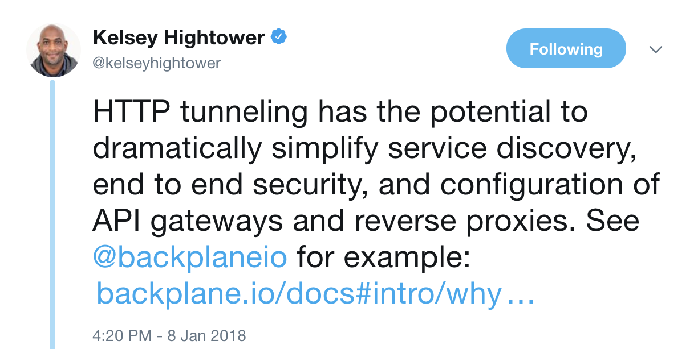
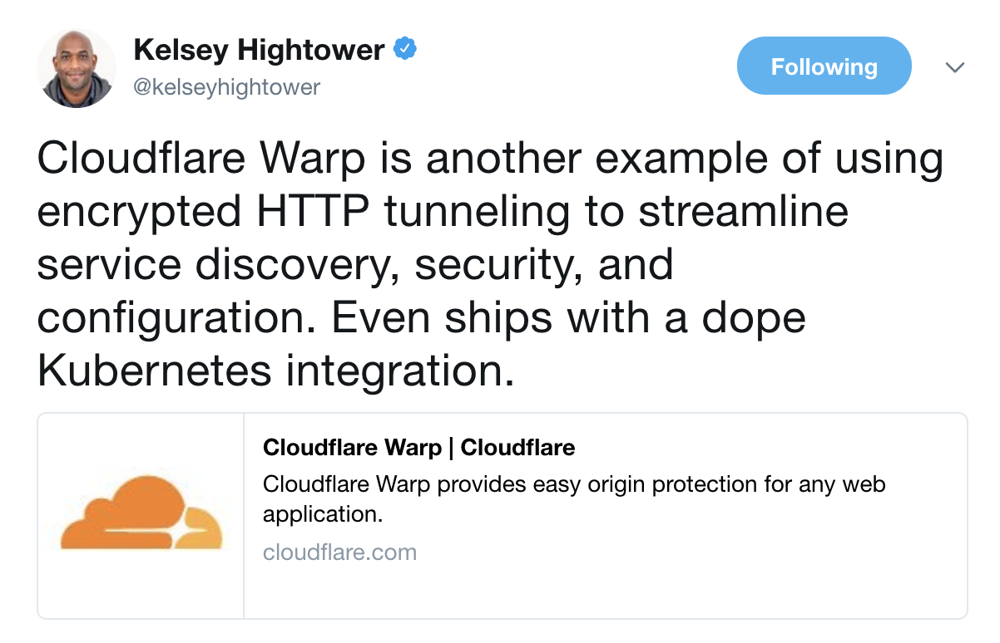
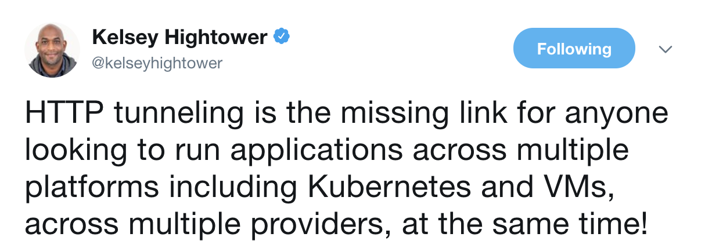
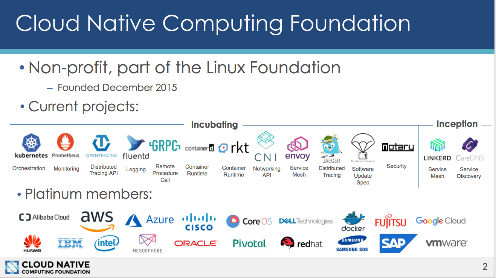
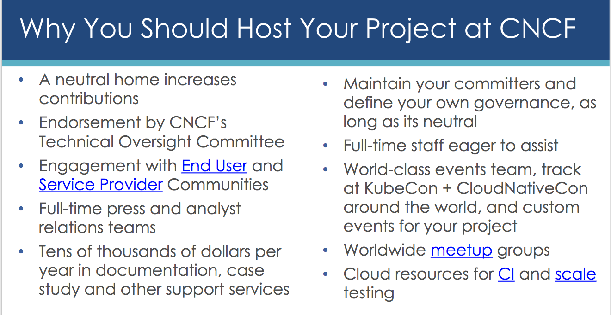
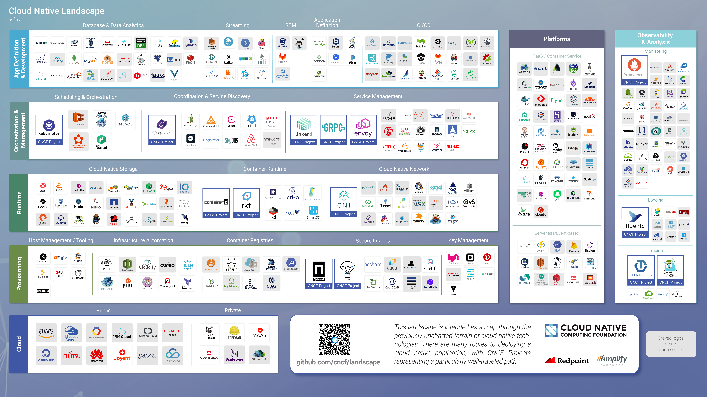

# luminate @ CNCF ?

---

---

---

---

## luminate's connector Vs ..

- [go-http-tunnel](https://github.com/mmatczuk/go-http-tunnel)
- [localtunnel](https://localtunnel.github.io/www/)
- [ngrok](https://ngrok.com/2)
- [backplane](https://www.backplane.io/)
- [reversehttp](http://reversehttp.net/)

---

## CNCF - CLOUD NATIVE COMPUTING FOUNDATION

---

---

- [why join?](https://www.cncf.io/projects/)

---

### landscape

---

[cncfLandscape](https://github.com/cncf/landscape)

### licnese

- Apache-2.0 is [recommanded](https://www.cncf.io/blog/2017/02/01/cncf-recommends-aslv2/)

---

---

- take it or leave it?
- connector server mode
- pluggable solution - batteries included ( security, loging, application discovery, scale ... )

---

## external links

* cncf [overview](https://docs.google.com/presentation/d/1BoxFeENJcINgHbKfygXpXROchiRO2LBT-pzdaOFr4Zg/edit#slide=id.g2c13d20ecb_1_0)
* [project proposals](https://github.com/cncf/toc/blob/master/process/project_proposals.adoc) e.g [kubernetes](https://github.com/cncf/toc/blob/master/proposals/kubernetes.adoc)
* kelsey's [tweet](https://twitter.com/kelseyhightower/status/950371704504598529) 
